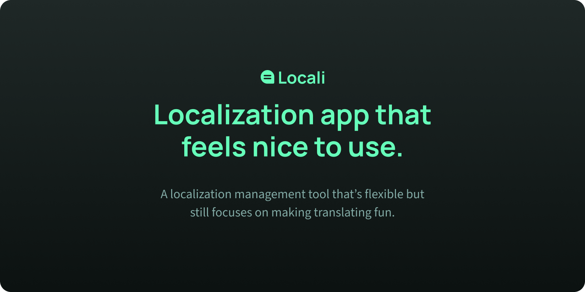

# ⚡Locali

Localization tool without all the complexity.

# 🔥Features

- Manage your translations, either synced without your Git repository or through uploading your files.
- Powerful check system, write your own checks in JS to make sure your localization files follow your rules.
- Community powered translations, open your project to the public and let your community help you with your translations.
- Review submissions, don't want to just accept any changes? Enable the submission system and review changes before they get added into your files.

# 🤝Contributors

