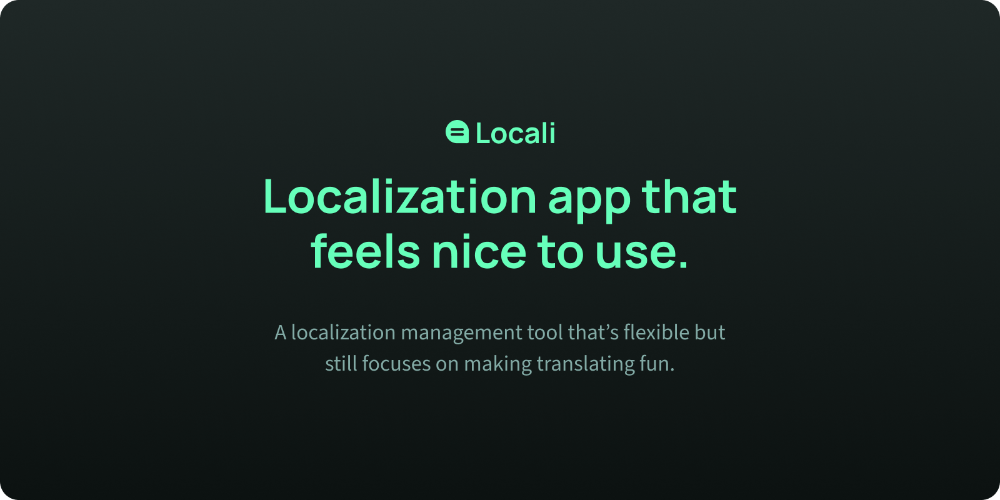

# ⚡@repo/frontend

The frontend for the Locali application.

# 🔥Tech stack

- Nuxt 3
- TailwindCSS
- Pinia

# 🧬Development

Instructions on how to run for development are not yet ready.

> [!TIP]
> You must be running **NodeJS 20** and use `pnpm` for the package manager.
